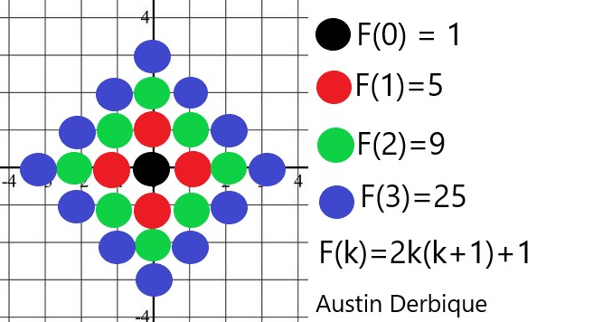
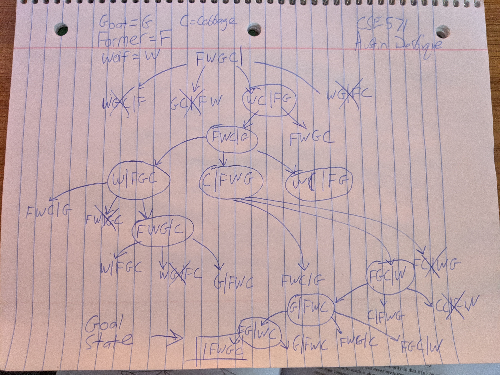

# Assignment 2
### Fall 2020: Artificial Intelligence
### Author: Austin Derbique

## Disclaimer
The following text shall not be used for the purposes of academic dishonesty. It is granted only for educational & archival purposes, not to be used by other students enrolled in an artificial intelligence class. This information is not guaranteed to be correct. Please consult the textbook [Artificial Intelligence A Modern Approach](https://www.amazon.com/Artificial-Intelligence-Modern-Approach-3rd/dp/0136042597) for up to date and accurate information.

# Exercises 

## Exercise 1.1 (6pt)
### Prompt
Prove each of the following statements, or give a counterexample:  

A) Breadth-first search is a special case of uniform-cost search.  
B) Depth-first search is a special case of best-first search.  
C) Uniform-cost search is a special case of A* search.  

### Response
In the textbook, **uniform-cost search** is defined to expand node *n* with the *lowest path cost g(n)*. This means that uniform-cost search expands nodes in order of their optimal path cost.

|Case|True/False|Supporting Claim|
|----|----------|----------------|
|A|True|Breadth-first search always expands the *shallowest* unexpanded node, whereas in contrast uniform-cost search expands by *lowest path cost*. Although uniform-cost search is an improvement upon BFS because of only exploring nodes with lowest path cost, the results are effectively the same. Therefore, BFS is a special case of uniform-cost search and uniform-cost search is the generalization. |
|B|False|**Depth-First Search** is considered an `uninformed search strategy`, wheres **Best-First Search** explores a graph by expanding the most promising node according to a specified rule. Source: [Wikipedia](https://en.wikipedia.org/wiki/Best-first_search)|
|C|True|**Uniform-Cost Search** has a function `F(n) = g(n)`, and **A\* Search** has a function `F(n) = g(n) + h(n)`. If all costs are the same, then UCS and A*S are identical.|

## Exercise 1.2 (18pt)
### Prompt

Consider the unbound version of regular 2D grid shown above. The start state is at the origin, *(0,0)*, and the goal state is at *(x,y)*. The agent can choose action North, South, East, West **or Stay** in any state.  
Consider ***tree search*** below (unless noted otherwise):

A) What is the branching factor or *b*?  
B) How many distinct states are there at depth *k* (for *k > 0*) in the search tree?  
C) What is the maximum number of nodes expanded by breadth-first search?  
D) What is the maximum number of distinct nodes expanded by breadth-frst search?  
E) What is the maximum number of nodes expanded by breadth-first ***graph*** search?  
F) Is `h = |u - x| + |v-y` an admissable heuristic for a state at `(u,v)`? Explain.  
G) How many nodes are expanded by A* graph search using `h` in `(f)`?  
H) Does *h* remain admissible if some links are removed? Explain.  
I) Does *h* remain admissible if some links are added between nonadjacent states? Explain.  

### Response

|Case|Answer|
|----|------|
|A|**Branching Factor** is defined as being the maximum number of successors of any node. In this case, there are `five` possible child nodes. *(North, South, East, West, Stay),*. Therefore, `b=5`|
|B|If k=1, there are 5 possible states. North, South, East, West or Stay. Although from k=0 to k=1, there is an increase in 4 states, this cannot continue because there cannot be any overlap. We must account for the growing edges as well as add the original state. Therefore, `F(k)=2k(k+1)+1`.|
|C|Given a goal state at *(x,y)* and starting at *(0,0)*, we can iterate through levels of k=n, we can go +1 and -1, in the x and y axis, visting non-visited adjacent nodes as well.  We may not revisit previously explored nodes. In order to reach the goal. This can be described as `4^(x+y)`.|
|D|The maximum number of distinct nodes expanded by breath-first search can be calulated to reach level k by adding up all distince states required to reach here. Therefore, D(k)=D(0) U D(k1) U ...D(k-1) U D(k). This leads to O(b*m), ultimately.|
|E|In a breadh-first *graph* search, the maximum number of nodes expanded to the number of states available, which is 2k(k+1)+1.|
|F|Yes, because the sum will always be a positive integer, and the agent can only move in x and y directions on the grid.|
|G|Because A* is optimized to be best case, the number of expanded nodes is `x + y`.|
|H|If some links are removed, the paths can be changed. In changing these paths, the heuristic is no longer admissible and cannot be guaranteed accurate. (It might now underestimate).|
|I|If links are added, then the amount of paths available can only help the chances of finding a path of optimality. Therefore, the heuristic *h* remains admissible.|

#### Figure 1.4.1 Varying levels of k

## Exercise 1.3 (15pt)
### Prompt
*n* vehicles occupy squares *(l,l)* through *(n,l)* (i.e., the bottom row) of an *n x n* grid. The vehicles must be moved to the top row but in reverse order; the vehicle *i* that starts in *(i,l)* must end up in *(n-i+1,n)*. On each time step, every one of the *n* vehicles can move one square up, down, lerft, or right, or stay put; but if a vehicle stays put, one other adjacent vehicle (but not more than one) can hop over it. Any vehicle is allowed to hop at most one other vehicle at a time. Two vehicles cannot occupy the same equare.

A) (2pt) Calculate the size of the state space as a function of *n*.  
B) (2pt) Calculate the branching factor as a function of *n*.  
C) (2pt) Suppose that vehicle *i* is at *(xi, yi)*; write a **nontrivial** admissible heuristic *hi( for the number of moves it will require to get to its goal location *(n-i+1,n)*, **assuming no other vehicles are on the grid.**  
D) (9pt) Which of the following heuristics are admissble for the problem of moving all *n* vehicles to their destinations? **Explain either way for each proposal below.**  
D.1) Sigma(hi)  
D.2) *max{h1...hn}*  
D.3) *min{h1...hn}*  

### Response
|Case|Answer|
|----|------|
|A|The state space is a combination of all spaces on the field (n x n), with n cars that can be scattered anywhere throughout the grid. This can be depicted as `(n x n)! choose n!`|
|B|Given the number of moves a car can make is 5, the branching factor at its worst case is `B(n)=5^n`.|
|C|An admissible heuristic for this problem would be the manhattan distance algorithm. Plugging in (n-i+1) for p1, xi for q1, n for p2, and yi for q2 into [|p1-q1| + |p2-q2|](https://en.wikipedia.org/wiki/Taxicab_geometry), We get `hi = | (n -1 + 1) - xi | + | n - yi |` which is an admissible heuristic. This gives us the exact cost to reach our destination.|
|D i|No, This is proven with Dii. The summation of hi will be > than max(h1...hn), which leads to an inadmissible heuristic in the event that cars are hopping.|
|D ii|No, In a perfectly terrible state, cars could be playing leap frog with each other. In other words, car hopping would lead to the cars traveling faster than the heuristic predicts.|
|D iii|Yes, because if the car is at its desination already, then the cost is zero and the heuristic is admissible.|

## Exercise 1.4 (11pt)
### Prompt

Once upon a time a farmer went to a market and purchased a wolf, a goat, and a cabbage. On his way home, the farmer came to the bank of a river and rented a boat. But crossing the river by boat, the farmer could carry only himself and a single one of his purchases: the wolf, the goat, or the cabbage.  

If left unattended together, the wolf would eat the goat, or the goat would eat the cabbage.The farmer's challenge was to carry himself and his purchases to the far bank of the river, leaving each purchase intact. He also wants to make as fewer trips as possible. 

A) (7pt) Forumate this puzzle as a search problem.  
B) (4pt) Design at least two non-trivial admissble heuristics and explain.
### Figure 1.4

### Response
We will assume the goat, wolf, and cabbage start on side A of the river and the goal state is to have all three on side B of the river. This problem can be solved in the following series of steps
1) Take the goat from side A to side B.  
2) Travel back to side A.  
3) Take the cabbage from side A to side B.  
4) Take the goat from side B to side A.  
5) Take the wolf from side A to side B.  
6) Travel back to side A.  
7) Take the goat from side A to side B.  

A) Figure 1.4.1
  

B.1) Heuristic = WG and GC have infinite weights and are not tolerated. This is because the goal is never reached if the wolf eats the goat or the goat eats the cabbage.  
B.2) Heuristic = number of objects on side B - number of objects on side A. This will incentivize the goal state of getting everything to side B.
